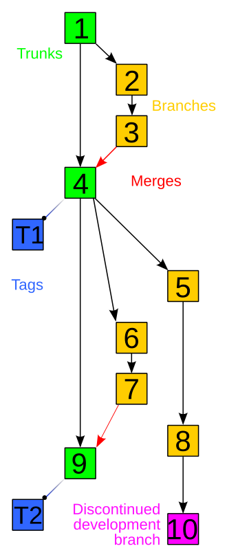

```admonish warning "TODO"
This section is currently unfinished! Help contribute more information.
```

# Git for Dummies

Welcome to this short crash course on Git.

## Why Git?

Git is what is known as a version control system, a piece of software that, as the name suggests, tracks "versions" of files. This is useful in that it allows many developers to coordinate development on a project without the need for extensive communication; edit your piece of the code, save it, and use Git to let everyone know about what you did. Additionally, having easy access to historical versions of a codebase streamlines bug-fixing and allows quick reversion to previous versions.

Git can be compared, in a way, to a "Wikipedia-style" editing methodology for filebases.

A particular strength of Git is its distributed nature, meaning that every person who works on a codebase using Git will have the entire codebase and its history stored locally. This further strengthens offline development and allows users to quickly make and review edits, as well as promoting greater accessibility for others to work on projects. This doesn't necessarily mean that there is no need for centralization; projects using distributed version control frequently use a central location to store data (e.g. GitHub).

## Common Version Control Terminology


An example of a version control history tree. Sourced from https://commons.wikimedia.org/wiki/File:Revision_controlled_project_visualization.svg

### Repository

Repository refers to a data structure storing metadata that points towards a file or directory structure. 

You can think of this as a labeled list of all files along with a complete history of modifications to these files.

### Branch

Branch is an independent separation of the codebase from another repository. This can also be referred to as a fork.

You can think of this as making a copy of another repository for separate development.

### Commit

Commit can either be used to refer to a changeset as an object, or can be used to refer to make changes into a repository. 

You can think of this as either talking about a specific change when used as a noun, or as a verb, changing something that is reflected in the repository.

### Push

Push copies changes from one repository to another, initiated by the source repository.

### Pull

Pull does the same as push but is initiated by the reciepient repository.

#### Pull request

Pull request asks for a source repository to combine the revisions made in a separately developed repository. This is referred to as merging. Pull requests frequently invovle discussion of the request.

### Fetch

Fetch is identical to pull conceptually, however the `git fetch` command is behaviorally different from `git pull` as it does not automatically merge changes into your working branch.

### Merge

Merge operations apply two sets of changes to file(s).

You can think of this as combining changes into a codebase.

### Resolve

Resolve is a user intervention addressing change conflicts to a file.

### Clone

Clone is creating a new repository using another repository as your base.

You can think of this as copying another repository for yourself.

### Others

A more complete list can be found [here](https://en.wikipedia.org/wiki/Version_control#Common_terminology).

## Getting Started

Find your respective download of Git [here](https://git-scm.com/downloads). 

Access the Git Command Line Interface (Git CLI). You should set a uniform username for your commits using a global flag, like below:

```
git config --global user.name "USERNAME'
```

GitHub (which Supersymmetry uses) prefers that you also set a commit email address to link your commits with your GitHub account.

```
git config --global user.email "EMAIL"
```

You can verify this information like so:

```
$ git config --global user.name
USERNAME

$ git config --global user.email
EMAIL
```

You may additionally authenticate with GitHub for security and ease of use reasons. You can use either [GitHub CLI](https://github.com/cli/cli#installation) or [Git Credential Manager (GCM)](https://github.com/git-ecosystem/git-credential-manager/blob/release/docs/install.md).

If you would rather use a token-based authentication method, you may generate a GitHub personal access token. This can substitute your password when prompted by Git.

VSCode also supports Git integration and allows you to authenticate through the IDE.

If none of the above authentication methods are used, Git will prompt you for your GitHub password every time you do an action that requires authentication.

All of the above fall under the umbrella of HTTPS authentication. SSH can also be used for authentication.

Congratulations! You are ready to use Git.

## Contributing to Supersymmetry

Download an instance of Supersymmetry from GitHub and import it into a Minecraft launcher (e.g. Prism Launcher). 

Open the Minecraft instance directory.

Create a fork of Supersymmetry for your own development needs. This can be done through your web browser, desktop GitHub client, or the GitHub CLI.

In your instance directory, delete all folders that have matching names with your forked repository. Afterwards,clone your forked repository in the directory. This is to let Git know that you will be making edits within your instance folder.

If you would like to sync your directory with the  Supersymmetry repository, you can run:


```
git remote add upstream https://github.com/SymmetricDevs/Supersymmetry 
```

You can then run:

```
git pull upstream BRANCH
```

To pull the changes from the Supersymmetry repository. Running a regular `git pull origin BRANCH` command will pull from your forked repository. Usually this branch will be main.

You can now edit files within your instance directory as you see fit.

In order to now commit your changes back to your forked repository, you must first add files to be included in the commit. This is known as staging your changes. You can do this via the command:

```
git add FILE
```

You can add the `-all` or `-A` flag to indicate you want to commit all files. After adding files, you may commit them via:

```
git commit -m COMMIT_MESSAGE
```

Then push your changes to GitHub by using the command:

```
git push origin BRANCH
```

Once pushed, you may make a pull request on the Supersymmetry repository with your commits.

Happy contributing!