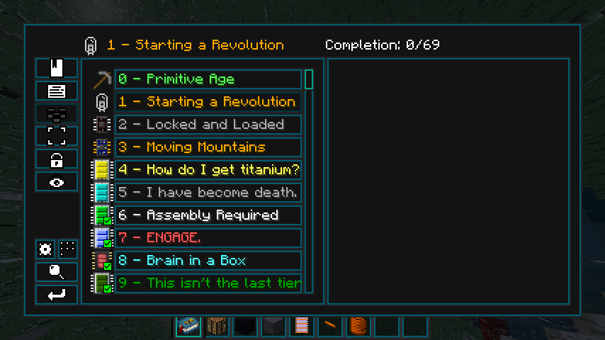

```admonish warning "TODO"
This section is currently unfinished! Help contribute more information.
```

# Writing Quests

Quests are provided through Better Questing Unofficial.

To create a quest, one uses ```/bq_admin edit``` to toggle editing mode, and then one can freely edit the quests from there. Anyone working with this MUST, MUST run ```/bq_admin default save``` to record the quest data to the files. Don't do yourself dirty.
There are a few things to know when editing quests:

The language files for our quests are stored in config/betterquesting/resources/supersymmetry/lang.

BQ(U)Tweaker allows images and links to be embedded into quests.

To add links, use this format: ```{Embed}TypeLink;<WebsiteLink>;<DisplayWidth>;<DisplayHeight>;<ButtonText>{Embed}```
As for images, use this: ```TypeImage;<ResourceLocation>;<DisplayWidth>;<DisplayHeight>;<ImageWidth>;<ImageHeight>{Embed}```

Also, to edit quest lines and quests, look in the lower left-hand part of the chapter-viewing interface:
