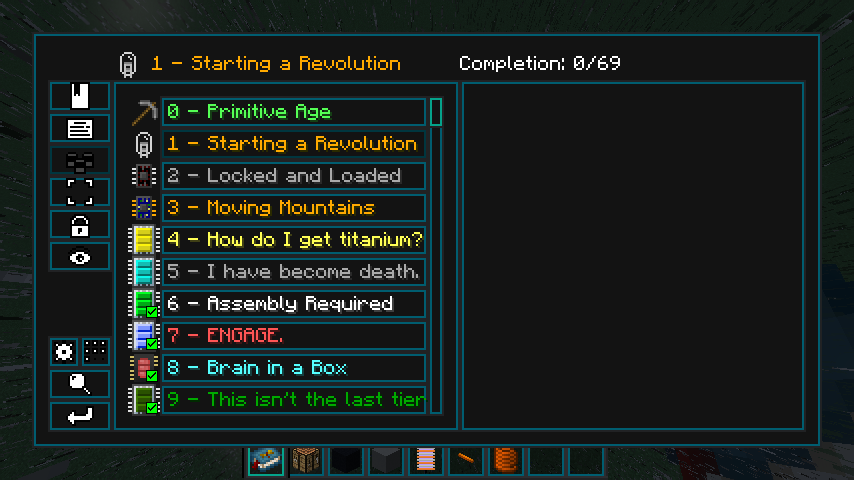

```admonish warning "TODO"
This section is currently unfinished! Help contribute more information.
```

# Writing Quests

Quests are provided through Better Questing Unofficial.

If you just need to edit a quest, the language files for our quests are stored in config/betterquesting/resources/supersymmetry/lang, _which are easier to edit directly for fixing small errors_, especially with [a list of Minecraft formatting codes handy](https://minecraft.wiki/w/Formatting_codes). build/questbook.py also saves your quest text here.

To create a quest, one uses `/bq_admin edit` to toggle editing mode, and then one can freely edit the quests from there. Anyone working with this must run `/bq_admin default save` to record the quest data to the files. You may also have to copy the /config/betterquesting folder back to your repository folder if it is not already linked.

```admonish warning "Format your quests!"
When you save quests in-game, BQu does not automatically translate your quest text, and it also adds a large amount of unneeded information to your files. We use the python script /build/questbook.py to format the files and fix them. When you copy your changes to your repository folder for committing, make sure you run this file with ```python3 build/questbook.py``` or so. If you try to commit unformatted files, you will see a bunch of changes (hundreds) in the commit staging area, so make sure to not commit those. Again, we will not accept PRs that unformat BQu files.
```

There are a few other things to know when editing quests:

The mod BQuTweaker allows images and links to be embedded into quests:

- To add links, use this format: ```{Embed}TypeLink;<WebsiteLink>;<DisplayWidth>;<DisplayHeight>;<ButtonText>{Embed}```
- As for images, use this: ```TypeImage;<ResourceLocation>;<DisplayWidth>;<DisplayHeight>;<ImageWidth>;<ImageHeight>{Embed}```

To edit quest lines and quests, look in the lower left-hand part of the chapter-viewing interface:

